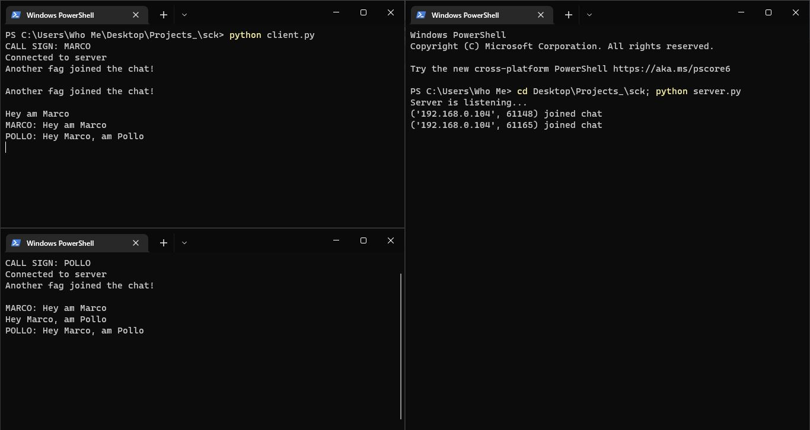

# Python TCP Chat 🐍

A simple Chat server and client implementation using [Python sockets](https://docs.python.org/3/library/socket.html) 

## Installation

All you need to get started with the Chat is a machine with [python](https://www.python.org/) installed.

1. Run `git clone https://github.com/JacobJax/Python-TCP-Chat.git`
1. Run `python server.py` to start the server. You can the run `python client.py` on multiple multiple machines to connect to the chat server.

> If you have problems running `python server.py` or `python client.py` try using `python3 server.py` and `python3 client.py` instead.